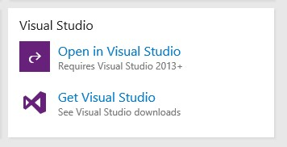
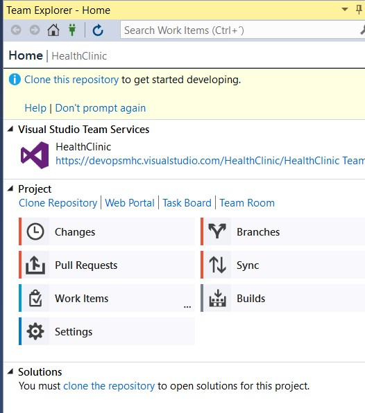
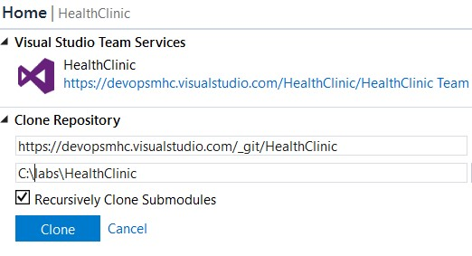
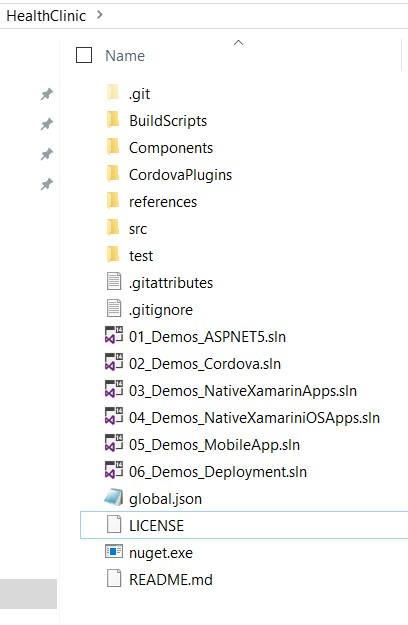
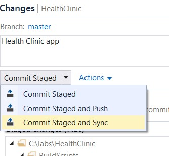
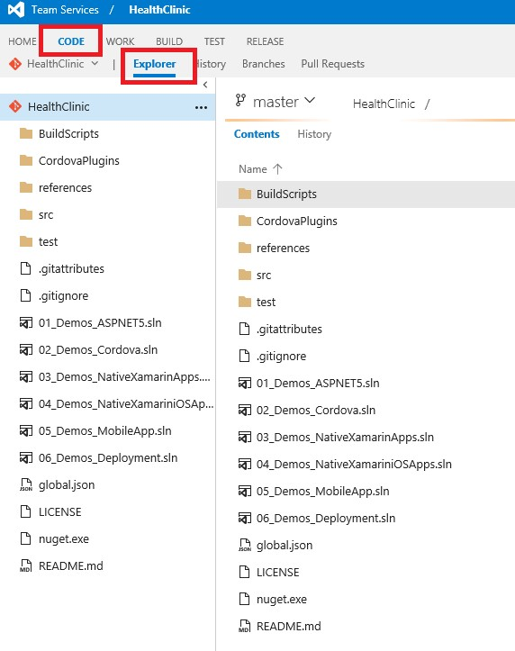

# CONNECT FROM VISUAL STUDIO

1.  Sign in to your Visual Studio Team Services account 

    > https://{youraccount}.visualstudio.com

1.	From your account overview page, select your team project. To find your team project, use Browse.

     

1.	Open Visual Studio.	

    

1.	Click Yes.	

    

1.	Click Clone the repository.	

    

1.	Set the local path for your repository.

    

1.	Click Clone.

1.	Copy the source code from [here](https://github.com/PlainConcepts/DevOps-Immersion/tree/master/source) to your local repository.

    

    > Depending on the team, there are different solutions in the root directory. For example, the Cordova team only uses the `02_Demos_Cordova` solution.

    > There is a `src` directory that contains the apps…Web, Xamarin and the Cordova application. The solutions reference the projects that are inside this folder.

    > There are other directories, as the BuildScripts, that is used in the build and release definitions.

1.	Go to Visual Studio.

1.	Choose  Changes.	

    

1.	Choose the directory.

1.	Click Stage.	

    

1.	Add a comment.

1.	Click Commit Staged and Sync.	

    > You can commit changes to your local Git repository    
        
    > Sync the changes to push your commits and pull changes from others.

    

    

1.	Go to your VSTS project.

1.	Click Code.	

    
