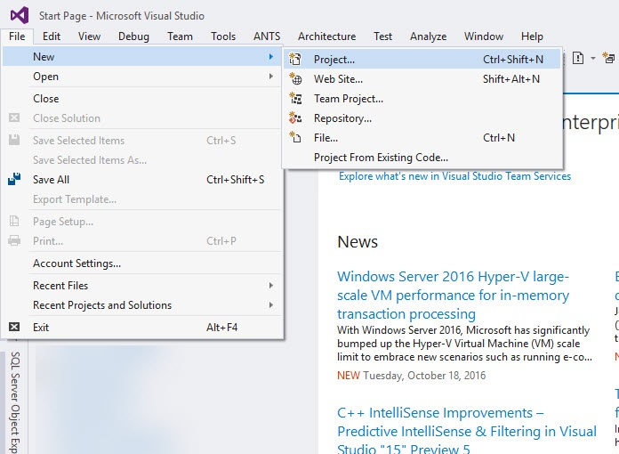
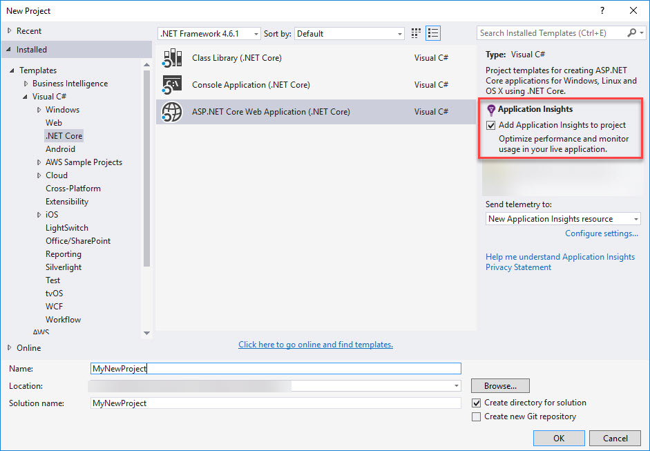
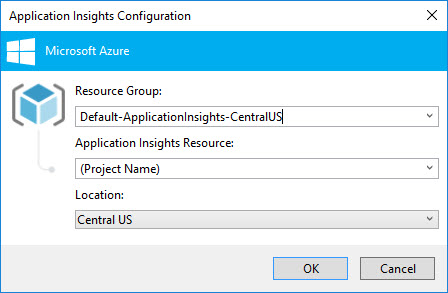
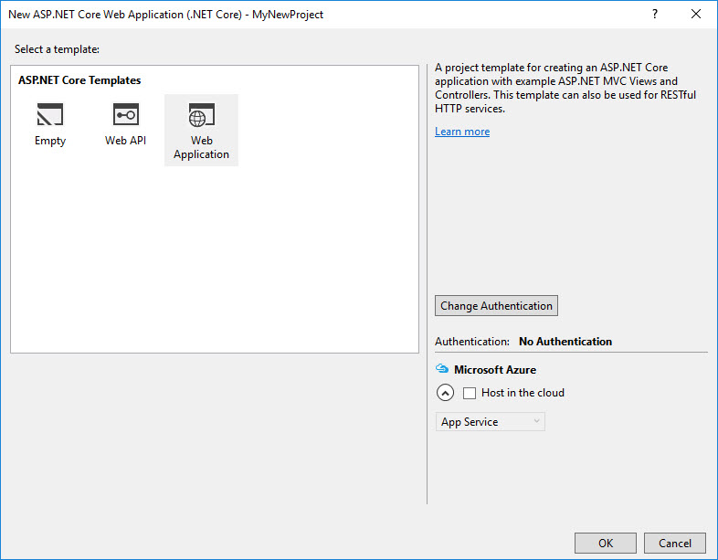
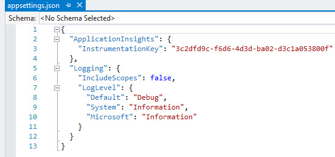
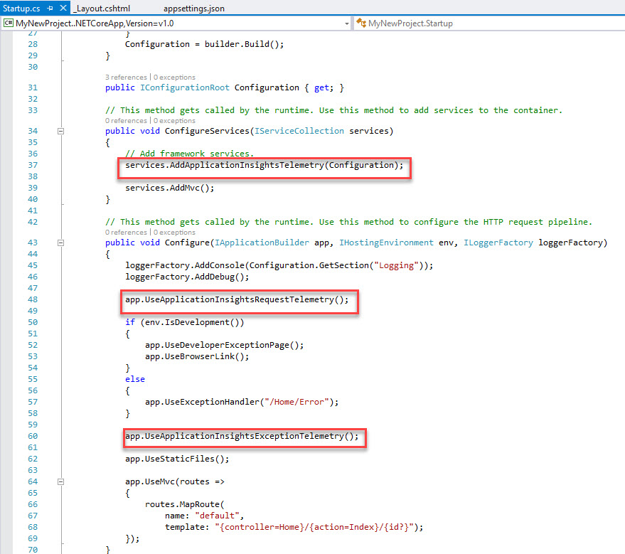
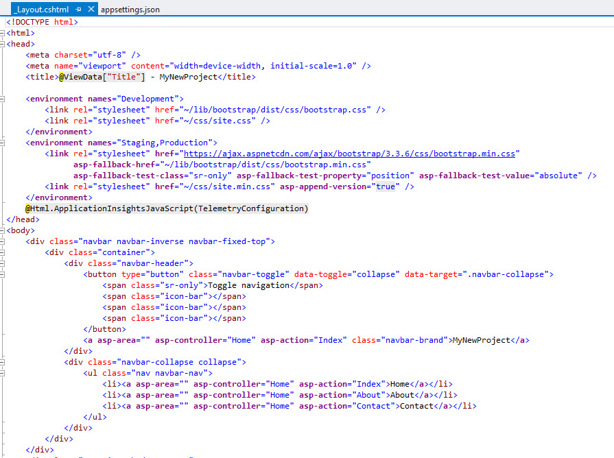
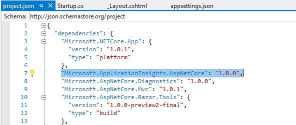

# ADD APPLICATION INSIGHTS TO NEW WEB APPLICATION

> Let's create a new web application and review how can we add Application Insights from the beginning.

1. Open Visual Studio. Select *File / New Project*.

    

1. Select *Visual C# / .NET Core / ASP.NET Core Web Application*, ensure to mark the checkbox *Add Application Insights to Project*.

    

    > In this step we are adding Application Insights to the project, if you want to review default values or make any change on them, click on **Configure Settings**

    

1. Click **Ok** on the next screen.

    

1. Open **appsetings.json** file and check the **Instrumentation Key** has been added.

    

    > As we saw in this lab configuring Application Insights, we have now the key already added from the beginning. The Nuget package, Startup.cs file and _layout.cshtml files has been modified to include Application Insights.

1. Open **Startup.cs** file, as you also see the lines for Application Insights configuration has already been added automatically.

    

1. Open **_Layout.cshtml** and check the particular line for client-side Javascript telemetry.

    

1. Open **project.json** file and check the Application Insights package has also been added.

    

> From this point we can also run the application, and see telemetry data as we did at the beginning of this same lab.
